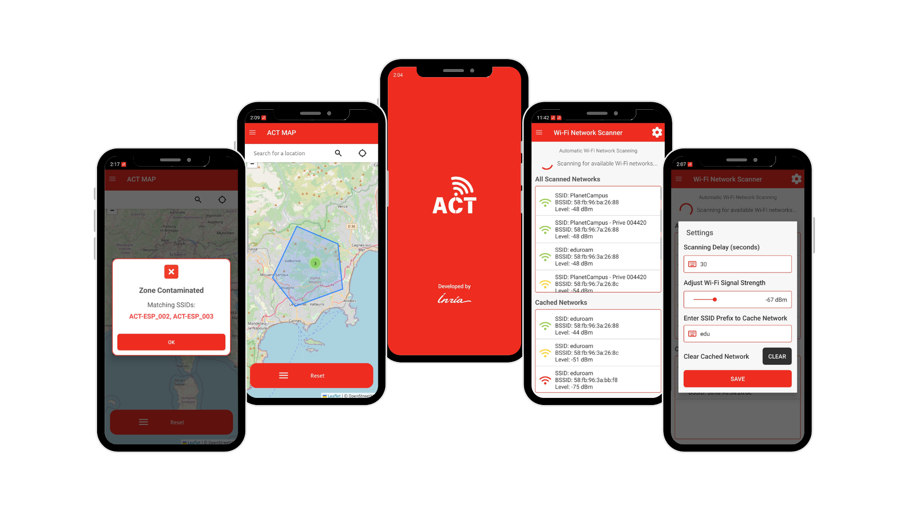

 
# ACT APP




## Description

The ACT mobile application is a cutting-edge tool designed to detect and monitor nearby Wi-Fi networks, with a particular focus on identifying potentially contaminated areas. Developed as part of the broader ACT project, this app leverages advanced IoT technologies to scan for Wi-Fi networks, filter them based on predefined prefixes, and store the relevant data in a cache. One of its standout features is the ability to draw polygons on a map to define specific zones. When a zone is drawn, the app compares the SSIDs from the cached networks with the points within the polygon and triggers alerts if there is a match, indicating whether the zone is safe or contaminated. This real-time monitoring and alert system enhances user safety by providing timely notifications about potential risks in their environment.


## Project Directory Structure for act_app

```
act_app/
|
|-- build.gradle.kts
|-- src/
    |
    |-- main/
    |   |-- java/
    |   |   |-- com/
    |   |       |-- example/
    |   |           |-- act_app/
    |   |               |-- ACTMapActivity.kt
    |   |               |-- AboutActivity.kt
    |   |               |-- ScreenReceiver.kt
    |   |               |-- SplashActivity.kt
    |   |               |-- WifiScanActivity.kt
    |   |               |-- WifiScanService.kt
    |
    |   |-- res/
    |       |-- drawable/
    |       |   |-- act.png
    |       |   |-- border.xml
    |       |   |-- button_background.xml
    |       |   |-- button_radius_corners.xml
    |       |   |-- circle_info_solid.xml
    |       |   |-- dialog_background.xml
    |       |   |-- dialog_background_contaminated.xml
    |       |   |-- dialog_background_safe.xml
    |       |   |-- gear_solid.xml
    |       |   |-- ic_launcher_background.xml
    |       |   |-- ic_launcher_foreground.xml
    |       |   |-- inria.png
    |       |   |-- keyboard_regular.xml
    |       |   |-- map_location_dot_solid.xml
    |       |   |-- rounded_button_background.xml
    |       |   |-- splash_background.xml
    |       |   |-- square_check_solid.xml
    |       |   |-- square_xmark_solid.xml
    |       |   |-- wifi_solid.xml
    |       |   |-- wifi_solid_green.xml
    |       |   |-- wifi_solid_yellow.xml
    |       |
    |       |-- layout/
    |       |   |-- act_map_activity_main.xml
    |       |   |-- activity_about.xml
    |       |   |-- activity_splash.xml
    |       |   |-- activity_wifi_scan.xml
    |       |   |-- dialog_alert.xml
    |       |   |-- dialog_settings.xml
    |       |   |-- list_item_custom.xml
    |       |   |-- nav_header.xml
    |       |
    |       |-- menu/
    |       |   |-- navigation_menu.xml
    |       |   |-- toolbar_menu.xml
    |       |
    |       |-- mipmap-anydpi-v26/
    |       |-- mipmap-hdpi/
    |       |-- mipmap-mdpi/
    |       |-- mipmap-xhdpi/
    |       |-- mipmap-xxhdpi/
    |       |-- mipmap-xxxhdpi/
    |       |
    |       |-- values/
    |           |-- colors.xml
    |           |-- strings.xml
    |           |-- themes.xml
    |
    |   |-- AndroidManifest.xml

```


## Permissions

The app requires the following permissions to function correctly:

- `INTERNET`: For accessing online resources.
- `ACCESS_FINE_LOCATION`: For precise location data.
- `ACCESS_COARSE_LOCATION`: For approximate location data.
- `ACCESS_WIFI_STATE`: To access Wi-Fi network information.
- `CHANGE_WIFI_STATE`: To enable or disable Wi-Fi.
- `FOREGROUND_SERVICE`: To run services in the foreground.
- `FOREGROUND_SERVICE_LOCATION`: To access location in the foreground.
- `FOREGROUND_SERVICE_CONNECTED_DEVICE`: To interact with connected devices.
- `ACCESS_BACKGROUND_LOCATION`: To access location data in the background.
- `WAKE_LOCK`: To keep the device awake.
- `ACCESS_NETWORK_STATE`: To access information about network connectivity.
- `VIBRATE`: To control the vibrator.
- `POST_NOTIFICATIONS`: To display notifications.


## Activities

### SplashActivity

- **Purpose**: Serves as the launch screen of the application. It displays a splash screen with the app logo and transitions to the main activity after a short delay.
- **XML**: `activity_splash.xml`
- **Functionality**:
  - Displays a splash screen for a set duration (2 seconds).
  - Automatically transitions to the `ACTMapActivity` after the delay.
  - Provides a visually appealing introduction to the app.

### ACTMapActivity

- **Purpose**: The main activity that displays a map view with Wi-Fi network information and allows users to interact with the map.
- **XML**: `act_map_activity_main.xml`
- **Functionality**:
  - Integrates a WebView to display a map from a specified URL.
  - Utilizes JavaScript interfaces to communicate between the WebView and the Android app.
  - Retrieves and logs cached Wi-Fi networks.
  - Updates the UI with the latest scanned and cached networks.
  - Requests necessary permissions for Wi-Fi and location access.
  - Starts and stops the `WifiScanService` based on the activity lifecycle.
  - **Polygon Drawing and Alerts**:
    - Allows users to draw polygons on the map to define specific zones.
    - When a zone is drawn, the app compares the SSIDs from the cached networks with the points within the polygon.
    - Triggers an alert if there is a match, indicating whether the zone is a "Safe Zone" or a "Contaminated Zone" based on the matching SSIDs.
    - Provides visual feedback and notifications to inform users about the status of the defined zones.

### WifiScanActivity

- **Purpose**: Allows users to scan for Wi-Fi networks and view the results in a list.
- **XML**: `activity_wifi_scan.xml`
- **Functionality**:
  - Displays a list of all scanned Wi-Fi networks.
  - Updates the list in real-time as new networks are detected.
  - Allows users to clear the cached networks.
  - Provides a settings dialog to customize scanning intervals, signal strength thresholds, and SSID prefixes.
  - Requests necessary permissions for Wi-Fi and location access.

### AboutActivity

- **Purpose**: Provides information about the application.
- **XML**: `activity_about.xml`
- **Functionality**:
  - Displays details about the app, such as version and developer information.
  - Offers a simple interface to learn more about the app's features and usage.

## Services

### WifiScanService

- **Purpose**: A foreground service that continuously scans for Wi-Fi networks in the background.
- **Functionality**:
  - Scans for Wi-Fi networks at regular intervals.
  - Caches network details and updates the UI through broadcast receivers.
  - Notifies users when new networks are cached.
  - Vibrates and plays a sound when new networks are detected.
  - Requires Wi-Fi and location permissions to function.

## Broadcast Receivers

### ScreenReceiver

- **Purpose**: Listens for screen on/off events to manage the `WifiScanService`.
- **Functionality**:
  - Starts the `WifiScanService` when the screen is turned off.
  - Stops the `WifiScanService` when the screen is turned on.
  - Helps in conserving battery by managing the service based on screen state.


## License

This project is licensed under the MIT License. See the [LICENSE](LICENSE) file for details.
